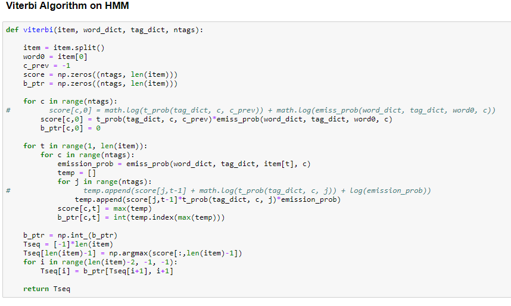
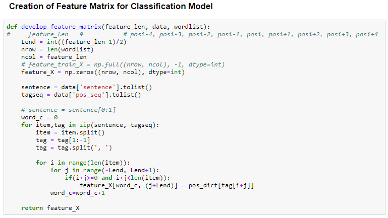
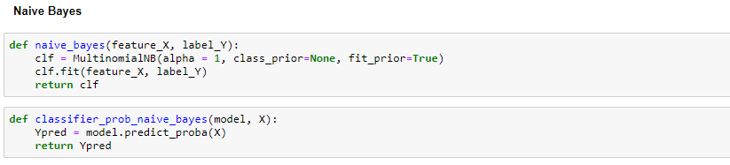
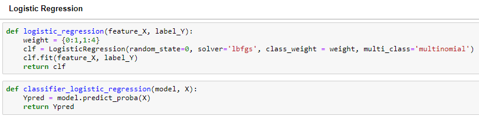
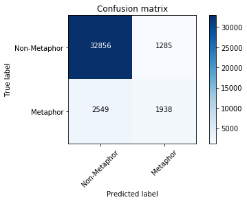
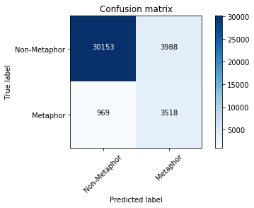

# Metaphor Detection with Sequence Labeling Methods

# Abstract

Hidden Markov Model and Classifier based models using Viterbi Algorithm are implemented on Word Level Metaphor Detection task. We used Naive Bayes and Logistic Regression as our classifiers for part-2 task and compared our results with HMM implementation. Post implementation, we got an F1 score of ~52% for HMM and an F1 score of ~62% for the Logistic Regression Classifier. Therefore, we got better results after implementing classifier based models as we had the flexibility of incorporating more features for a given word.

# Introduction

We have modeled metaphor detection classifier using both HMM method and Naive Bayes classification techniques. The training dataset given consists of 6323 sentences and each word of these sentences is marked with corresponding Part of Speech tag and whether metaphor or not in the form of an array. The following data are from the data set. 

Dataset	Train
Number of Sentences	6323
Number of labels	116622
Number of Non-metaphor labels	103571
Number of Metaphor labels	13051
Table 1.1 Train dataset overview

#	Design and Implementation of the HMM model.

In this section, we briefly describe our model. HMMs can be applied in many fields where the goal is to recover a data sequence that is not immediately observable (but other data that depend on the sequence are). Applications include Part of Speech tagging, machine translation, and speech recognition.

##	Model

### The Hidden Markov Model (HMM)

A Markov chain is useful when we need to compute a probability for a sequence of observable events. In many cases, however, the events we are interested in are hidden. A HMM allows us to talk about both observed events and hidden events. 

The goal of HMM decoding is to choose the tag sequence t1n that is most probable given the observation sequence of n words w1n based on Bayes rule, Markov chain assumption and dropping the denominator yields

### Viterbi Algorithm

The main idea of using Viterbi Algorithm is to reduce the time complexity from O(c^m) to O((c^2)*m) where c is the number of possible classes and m is the length of the sentence. We accomplish this by sweeping forward word by word and keeping a track of indexes that gives rise to the scores. With proper indexing, we get the sequence of classes for a sentence during backpropagation step.  

## Description and Implementation

In this section, we report our implementation approach. We performed preprocessing, used the training dataset to train our HMM model and validated it against the validation dataset provided. Then we ran our trained HMM model on the test set and exported the result in the csv format. The steps and results obtained are explained below. 

### Preprocessing

#### Handling UNK words

There are unknown words in our validation data and test data. To deal with these unknown words we incorporated UNK words in our HMM model by placing UNK in the training corpus with a probability of 0.005 for every word we see in the corpus. In other words, we scanned every word of training corpus and replaced it with UNK with binomial distribution probability of 0.005. This essentially means 0.5% of the entire training corpus will have the UNK word randomly placed. Following this, we scanned through our validation and test corpus for words that are not present the training corpus and replaced those words with UNK.  

#### Lowercasing

We converted all the words to lowercase as a preprocessing step. The performance of the model with and without lowercasing is evaluated and described section 4.1.

#### Dictionaries and Lists as Data Structures

First, we have created a list of all the words from all the sentences in the training dataset. Similarly, we have merged the list of 0’s and 1’s for metaphor labels. As a sanity check, we matched the word list with the metaphor labels list and found that length of both lists is matching as expected. We created a dictionary with individual word as a key and a pair of metaphor count and non-metaphor count as the value. This dictionary would be useful to find the emission probability. Thereafter, we created another dictionary of tag counts consisting both of unigram and bigram counts which would be useful to find the transition probability.

### Transition Probabilities

In order to find the transition probabilities we have created a dictionary that counts the number of occurrences of label (00), (01), (10) and (11). These bigram counts can be utilized to find the transition probabilities which shall be used in HMM model. We have also counted the unigrams. While counting we have also considered the last word of the sentence and the first of the next sentence transitions by adding a ‘< s>’ at the end of the sentence. For transition probabilities based on the above counts, we have found the probabilities for all types of transitions like 0->0, 0->1, 1->0, 1->1. Since there are only 2 labels we can have at most 4 types of transitions.

### Emission Probabilities

For emission probabilities, we have used a dictionary which we have created earlier, where we have the word with a count of label 0 and label 1 occurrence. Based on this data, we have calculated probabilities of of word given labels. 

### Viterbi Implementation

For implementation of Viterbi on a sentence, first we have split the sentence to words, the score and the back pointer are calculated as below:

Table 2.2.4.1 Calculation of scores and backpointers for a sentence with 5 words
Word	Score (si)	Back pointer
[0]	[p[0].p[word[0]/0], p[1].p[word[0]/1]]	[0, 0]
[1]	[max{s0([0]).t(0,0).p[word[1]/0], s1([0]).t(1,0).p[word[1]/0]}, max{s0([0]).t(0,1).p[word[1]/1], s1([0]).t(1,1).p[word[1]/1]}]	[argmax s1([1]), argmax s0([1])]
[2]	[max{s0([1]).t(0,0).p[word[1]/0], s1([1]).t(1,0).p[word[1]/0]}, max{s0([1]).t(0,1).p[word[1]/1], s1([1]).t(1,1).p[word[1]/1]}]	[argmax s1([2]), argmax s0([2])]
[3]	[max{s0([2]).t(0,0).p[word[1]/0], s1([2]).t(1,0).p[word[1]/0]}, max{s0([2]).t(0,1).p[word[1]/1], s1([2]).t(1,1).p[word[1]/1]}]	[argmax s1([3]), argmax s0([3])]
[4]	[max{s0([3]).t(0,0).p[word[1]/0], s1([3]).t(1,0).p[word[1]/0]}, max{s0([3]).t(0,1).p[word[1]/1], s1([3]).t(1,1).p[word[1]/1]}]	[argmax s1([4]), argmax s0([4])]
    Notations: P[label] = unigram count of label/ unigram count of all labels, p[word/label] = emission probability, t(label,          label) = transition probability, slabel([word]) = score of the word for the label

For the first word:

Score = transition probability * emission probability

Where transition probability is the probability of the label. (like for label 0 its number of unigram 0 labels in training corpus divided by number of unigrams 0’s and 1’s. Similarly for 1). Emission probability can be directly taken from the dictionary we have created for emission probabilities. For the back pointer of the first word, we have considered 0. 

For words from 2nd to last:
Score = Score of the Previous word_labelwise * transition probability * emission probability.

Where the score of the previous word is taken from the previous word. The transition probability of label from previous word to current word is taken from the bigram dictionary created. Finally emission probability is multiplied. This score shall be calculated from all previous labels to the current label. 

Back Tracing:
Based on the score of the last word, we select the label based on the highest value. Then we go to the previous column and check what label is the backpointer matrix for the last word is pointing to and we select that label for this column. We repeat this process upto the first word to get the sequence of tags.

 
 
  Fig 2.2.4.1 Screenshot of Viterbi implementation in Python

#	Design and Implementation of the Naive Bayes Classifier and Logistic Regression Classifier(part-2)

## Naive Bayes Model

Naive Bayes is a probabilistic classifier that makes classification using Maximum A Posteriori decision rule in a Bayesian setting. Naive Bayes model uses Bayes approximation and Conditional independence approximation as below:

P(x1,.....,xn) = P(x1|c).P(x2|c).P(x3|c)....P(xn|c)
where,
P(xj|c) = count(word xj in training docs with label c)/count(word tokens in training docs with label c)

CMAP = argmax P
Multinomial Naive Bayes classifier is as below
CNB = argmaxc𝝐C P(cj)  ℿx𝝐X P(x|c)

## Logistic Regression Model

In this classification we determine the probability of any observation will be certain class or not. It estimates the coefficients based on maximum likelihood function. 

## Description and Implementation

In this section, we report our implementation approach. We performed preprocessing, used the training dataset to train our Viterbi model using Naive Bayes/Logistic Regression classification and validated it against the validation dataset provided. Then we ran our trained model on the test set and exported the result in the csv format. The steps and results obtained are explained below. 

### Preprocessing for Naive Bayes/Logistic Regression Classification

#### Handling UNK words

Similar to section 2.2.1.1 of this report.

#### Lowercasing

Similar to section 2.2.1.2 of this report. 

#### Dictionaries and Lists as Data Structures

Similar to section 2.2.1.3 of this report.

#### Part of Speech with ID tagging

We have tagged unique integer tags for all types of part of speech considered in the training. We didn’t consider one hot encoder since it will blow up the feature matrix dimensions. 

### Creation of Feature vector

For creating a feature vector to train the Naive Bayes model, we considered the POS tags of a window of size k on both sides of the current word. So, for every word in the corpus, we have a feature vector of size 2k+1, since k is the number of POS tags on each side of the word and 1 corresponds to the POS tag of the current word. There are edge cases, which we had to handle where the POS tags at a certain distance from the current word doesn’t exist. for eg: the case where the first word in the sentence doesn’t have k words in the front or the last word which doesn’t have k words after it. We handled these cases, by updating the missing values by 0. Moreover, we tested different values for k and found that k=2(window size=2*2+1=5), gave us the best results. We analyzed the results and think that when k is too low, it doesn’t capture much information about the neighbouring tags, and when k is too large, it adds more noise to our feature vector and doesn’t generalize well in the validation dataset.
 Table: 3.3.2.1 Feature vector representation for Naive Bayes classification
pos(tag ID)		pos(tag ID)	pos(tag ID)	pos(tag ID)	pos(tag ID)	pos(tag ID)		pos(tag ID)
pos[w[i-k]]	…..	pos[w[i-2]]	pos[w[i-1]]	pos[w[i]]	pos[w[i+1]]	pos[w[i+2]]	……	pos[w[i+k]]
…..	…..	…..	…..	…..	…..	…..	…..	…..

Code snippet for generating feature matrix is as follows:

  
  
  Fig 3.3.4.1 Screenshot of Feature vector preparation for Naive Bayes classification in Python

### Classifier Probabilities

After experimentation in section 4, we have replaced the transition probabilities with the classifier probabilities.For transition probabilities instead of using the label transition probabilities as we did in HMM model, we have used Naive Bayes/Logistic Regression classification to find the probabilities of each token whether the token is a metaphor or not given features. In section 4, we played around with different combinations for replacing the transition and emission probabilities with classifier probabilities. 

### Emission Probabilities

Similar to section 2.2.3 of this report.

### Viterbi Implementation

Similar to section 2.2.4 of this report. (except for the transition probabilities replaced by classifier probabilities).

### Implementation of Naive Bayes

We have used Naive Bayes model from sklearn framework to find the probabilities of metaphor label given the word. 

  
  
Fig 3.3.6.1 Implementation of Logistic Regression classifier

### Implementation of Logistic Regression

We have used logistic regression model from sklearn framework to find the probabilities of metaphor label given the word. 

  
  
Fig 3.3.7.1 Implementation of Logistic Regression classifier

# Experiment Design and Methodology and Results

For the general purpose of evaluation, we looked into Recall, Precision and F1 scores more than the Accuracy since this is a task of highly imbalanced classification. Out of the three above mentioned metrics, we mostly looked in F1 score as F1 is basically the harmonic mean of Precision and Recall. Hence F1 score reflects a holistic model performance. 

## Experiment Design and Methodology on HMM model

We ran the HMM model by varying different parameters and evaluated the results. We tried two variations as following:
●	Lowercasing: We ran the model first with the original texts and then the after lowercasing the texts. We found that lowercasing helps in slightly better performance. The methodology used is lowercase() function in python. 
●	UNK Word Percentage: After determining the lowercase parameter, we ran our model with different proportions of UNK words incorporated into the training texts. We scanned through every word in the training corpus and converted it into UNK with a chosen probability (p = 0.001, 0.005, 0.01) using a binomial distribution. We found that this method best generalizes the randomness of assignment.
Table 4.1.1 shows the comparison of results with the experiments we conducted. We got the best result with an UNK word percentage of 0.5 and after lowercasing the texts.

Table 4.1.1 Experiment parameters tuning for HMM model (part-1)
UNK word Probability	LowerCased	Precision	Recall	F1-Score	Accuracy
0.001	No	60.1	44.7	51.3	90.1
0.01	No	60.3	43.4	50.5	90.1
0.01	Yes	60.2	44.5	51.2	90.1
0.005	Yes	60.3	44.9	51.5	90.2

## Experiment Design and Methodology on classification model (part-2)

We played around with a large number of features as a part of experimentation design which are listed below.
●	Replacing Transitional or Emission Probability with Classifier Probability: We tried different combinations. First we replaced the emission probability with Classifier Probability and kept the transitional probability as is. This gave us a really bad result with an F1 score of ~9%. Then we decided to replace the Transition Probability with our classifier probability (keeping emission probability) and got decent accuracy. We conducted the experiments with this setup. We suspect that emission probability is needed as that incorporates our word counts and UNK counts which brings in context. This matched our expectations.
●	Type of Classifier: We used two types of classifiers, one generative (Naive Bayes) and the second one is discriminative (Logistic Regression). We conclude that Logistic Regression is giving us better results compared to Naive Bayes. However, we tried our feature length parameter on Naive Bayes as shown in Table 4.2.1. We suspect that logistic regression is giving us better result because we added class_weights as an external parameter. This is an important parameter to consider since our classification task is highly imbalanced. This matched our expectations.
●	Feature Length: In 3.3.2 we talk about generation of feature matrix for the purpose of our classification. The length of the feature matrix is something that we played around with as an experimental parameter. We concluded that a feature length of 5 works best for the metaphor detection task given our training and validation/test sets. As per our design of feature matrix, a feature length of 5 means we considered the POS of two words before the classification word and two words after the classification word and also consider the POS of the classification word, which makes the total count 5. When we selected feature_length more than 5, our performance reduced as we were considering more context than required and the classifier was learning useless long patterns. When we choose less than 5 then it was too less of a context for the classifier. This matched our expectations.
In a sentence, if there are not enough words before/after the target word, we handle this case by just keeping the POS tag ID ZERO. All the valid POS tag IDs start from 1 and above. Hence a POS tag ID zero typically means that we don’t have a word there. 
●	Class Weights:  We realized that this is a highly imbalanced classification problem. This typically means that the classifier  overfits to the non-metaphor tag and underfits for the metaphor tag. One way to get around this issue is to externally add class weights. In binary classification problem such as ours we need 2 weights. Internally these weights are multiplied by the weights generated by the model and balances the importance of both the classes. We typically give more weightage to the class which is underrepresented. In our case Metaphors. We used {metaphor:Non-metaphor=(1:1), (2:1), (4:1)} as our experimental parameters and found that a 4:1  weight scheme works best.
●	Target Word Frequency as Metaphor: We also tried including an additional parameter into our feature matrix described in 3.3.4.2. We added an extra column at the end of the matrix and added the number of times the target word acts as a metaphor. We experimented with this feature matrix in Logistic Regression with a feature length of 5 and class weight of 4:1 and got the following result:
P, R, F1 of 43.5 78.65 56.0 respectively. This result is comparable to the results of the previous feature matrix.

Table 4.2.1 Experiment parameters tuning for classification model (part-2)
k (feature length)	Classifier Type	Logistic weight	Precision	Recall	F1-Score	Accuracy
7	NB	N/A	51.4	50.2	50.8	88.7
5	NB	N/A	52.4	50.7	51.6	88.9
3	NB	N/A	54.2	47.2	50.5	89.2
5	LR	1:1	57.1	48.7	52.6	89.8
5	LR	1:4	46.8	78.4	58.6	87.1
7	LR	1:2	51.9	64.9	57.7	88.9
NOTE: NB: Naive Bayes, LR: Logistic Regression

# Error Analysis and comparison of HMM model with classifier based model:

For the purpose of analysis and comparison, we selected two metaphors in a sentence, one that was classified corrected by HMM but not by the classifier based model and vice versa. Further, we tried to reason out why that was the case.

Sentence 1: “Adam decided to hold back Miranda 's bombshell until later , after Elinor drank her evening glass of champagne”

In the above sentence, the metaphor “hold” was classified correctly by the classification model but not by HMM. We suspect that incorporating the neighbouring POS tags on both sides in the feature matrix worked to our advantage since the next word ‘back’ is also a metaphor and the information about it’s POS tag along with the tags of the neighbouring words could have helped to give the correct prediction. Whereas, in case of HMM, it uses the information about the transitional probability instead, which is limited to only one previous label.

Sentence 2: “His small bright blue eyes swept disparagingly over the minimalized black and white flooring , stainless steel chairs and black wooden bar .”

In the above sentence, the metaphor “swept” was classified correctly by the HMM but not by the  classification model. We suspect that, the sequence of POS tags of window size 5 around the metaphor “swept” are not so indicative of the fact that there exists a metaphor at position 3(relative to the window size) and this might be due to the possibility that such sequence of POS tags were not much observed during our training phase. 

Overall, we observed that classifier based model performed better than HMM. The F1 score on the test set was 52% for HMM and around 62% for Model 2. We observed that along-with lexical generation probabilities, incorporating the neighbouring POS tags information gave pretty good results in Model 2. Moreover, deciding an ideal number of neighbors was also an important factor.. 

In general, for the error patterns we observed that, HMM didn’t perform well in cases where the neighbouring POS tags are useful indicators of a word being a metaphor just as we explained in Sentence 1 above. Whereas, we suspect that classifier based model didn’t perform well in some cases where the POS tag pattern weren’t observed well in the training dataset just like Sentence 2 above.  Moreover, we analyzed that if a metaphor is the last word in a sentence, classifier based model wouldn’t perform well, since the next 2 POS tags wouldn’t be present and this might provide less information to predict the real label for this word.

Moreover, we also implemented confusion matrices for both the classifiers as a comparative study. Fig 5.1 and 5.2 shows the confusion matrices. 

   

Fig 5.1 : HMM
          

            
Fig 5.2 : Classifier based model(Logistic)

# References

[1] Scikit Learn Documentation for Logistic and Naive Bayes
[2] https://medium.com/data-science-group-iitr/logistic-regression-simplified-9b4efe801389
[3] https://medium.com/@kangeugine/hidden-markov-model-7681c22f5b9

